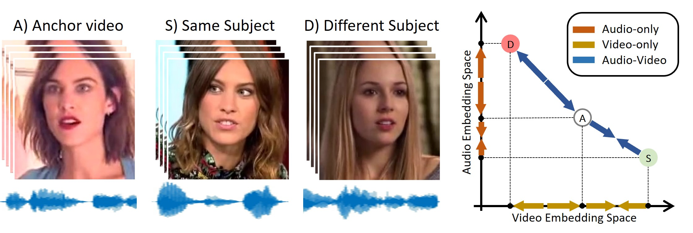

# Audio-Visual Person-of-Interest DeepFake Detection
Davide Cozzolino, Alessandro Pianese, Matthias Nie&szlig;ner, Luisa Verdoliva

  

Face manipulation technology is advancing very rapidly, and new methods are being proposed day by day. The aim of this work is to propose a deepfake detector that can cope with the wide variety of manipulation methods and scenarios encountered in the real world. Our key insight is that each person has specific biometric characteristics that a synthetic generator cannot likely reproduce. Accordingly, we extract high-level audio-visual biometric features which characterize the identity of a person, and use them to create a person-of-interest (POI) deepfake detector. We leverage a contrastive learning paradigm to learn the moving-face and audio segments embeddings that are most discriminative for each identity. As a result, when the video and/or audio of a person is manipulated, its representation in the embedding space becomes inconsistent with the real identity, allowing reliable detection. Training is carried out exclusively on real talking-face videos, thus the detector does not depend on any specific manipulation method and yields the highest generalization ability. In addition, our method can detect both single-modality (audio-only, video-only) and multi-modality (audio-video) attacks, and is robust to low-quality or corrupted videos by building only on high-level semantic features. Experiments on a wide variety of datasets confirm that our method ensures a SOTA performance, with an average improvement in terms of AUC of around 3%, 10%, and 7% for high-quality, low quality and attacked videos, respectively.

## Code

- [Demo code](https://github.com/grip-unina/poi-forensics/app_code/)
- The training code is coming soon
