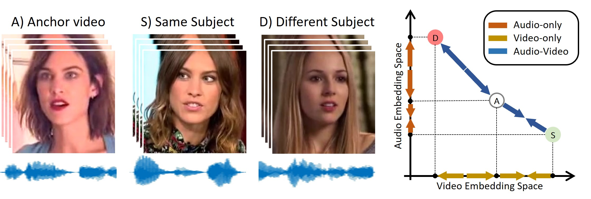

[](https://github.com/grip-unina/poi-forensics/tree/main/app_code)
[](https://arxiv.org/abs/2204.03083)
[](https://www.grip.unina.it)

  
  
<center></center>

Face manipulation technology is advancing very rapidly, and new methods are being proposed day by day. The aim of this work is to propose a deepfake detector that can cope with the wide variety of manipulation methods and scenarios encountered in the real world. Our key insight is that each person has specific biometric characteristics that a synthetic generator cannot likely reproduce. Accordingly, we extract high-level audio-visual biometric features which characterize the identity of a person, and use them to create a person-of-interest (POI) deepfake detector. We leverage a contrastive learning paradigm to learn the moving-face and audio segments embeddings that are most discriminative for each identity. As a result, when the video and/or audio of a person is manipulated, its representation in the embedding space becomes inconsistent with the real identity, allowing reliable detection. Training is carried out exclusively on real talking-face videos, thus the detector does not depend on any specific manipulation method and yields the highest generalization ability. In addition, our method can detect both single-modality (audio-only, video-only) and multi-modality (audio-video) attacks, and is robust to low-quality or corrupted videos by building only on high-level semantic features. Experiments on a wide variety of datasets confirm that our method ensures a SOTA performance, with an average improvement in terms of AUC of around 3%, 10%, and 7% for high-quality, low quality and attacked videos, respectively.

## Bibtex
 
```
@InProceedings{Cozzolino2023poi,
    author    = {Cozzolino, Davide and Pianese, Alessandro and Nie{\ss}ner, Matthias and Verdoliva, Luisa},
    title     = {Audio-Visual Person-of-Interest DeepFake Detection},
    booktitle = {Proceedings of the IEEE/CVF Conference on Computer Vision and Pattern Recognition (CVPR) Workshops},
    month     = {June},
    year      = {2023},
    pages     = {943-952}
}
```

## Acknowledgments
 
We gratefully acknowledge the support of this research by a TUM-IAS Hans Fischer Senior Fellowship, a TUM-IAS Rudolf Moßbauer Fellowship and a Google Faculty Research Award.
This material is also based on research sponsored by the Defense Advanced Research Projects Agency (DARPA) and the Air Force Research Laboratory (AFRL) under agreement number FA8750-20-2-1004.
The U.S. Government is authorized to reproduce and distribute reprints for Governmental purposes notwithstanding any copyright notation thereon.
The views and conclusions contained herein are those of the authors and should not be interpreted as necessarily representing the official policies or endorsements, either expressed or implied, of DARPA or the U.S. Government.

In addition, this work has received funding by the European Union under the Horizon Europe vera.ai project, Grant Agreement number 101070093, and the ERC Starting Grant
Scan2CAD (804724). It is also supported by the PREMIER project, funded by the Italian Ministry of Education, University, and Research within the PRIN 2017 program.

  
